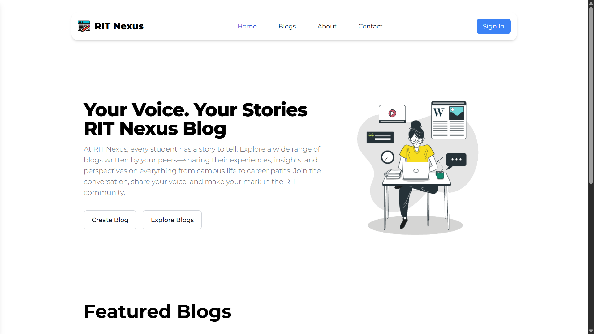
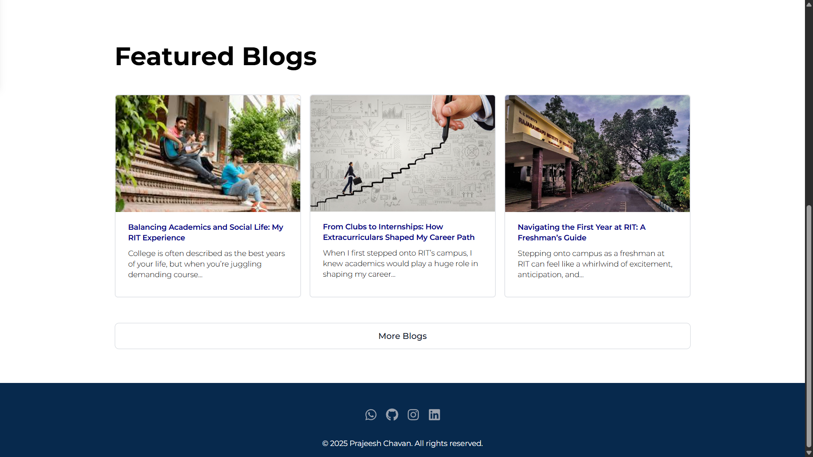
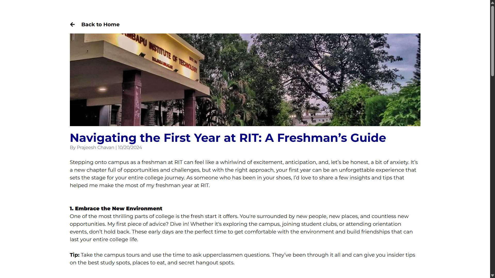

<div align="center">

# ✍ RIT Nexus

**Centralized Blogging Platform for RIT Campus Community**

[](https://rit-nexus.vercel.app/)
[](https://rit-nexus.vercel.app/)
[](https://nodejs.org/)
[](https://reactjs.org/)

_A modern blogging hub for students, alumni, and faculty to share stories, experiences, and thoughts at RIT._

**Created by [Prajeesh Chavan](https://github.com/prajeesh-chavan)**

[🚀 Quick Start](#-quick-start) • [✨ Features](#-features) • [🔧 Installation](#-installation) • [🏗️ Architecture](#-architecture) • [🤝 Contributing](#-contributing)

</div>

---

## 🎥 Preview

<div align="center">
<!-- Add screenshots here -->



</div>

---

## ⭐ Why RIT Nexus?

<table>
<tr>
<td>

**📝 Write & Share**

- Publish blogs, experiences, and stories
- Share thoughts and campus life moments
- Alumni can reminisce and inspire

</td>
<td>

**👥 Community**

- Read posts from students, alumni, and faculty
- Comment & interact on articles
- Discover trending campus topics

</td>
<td>

**🔍 Discover**

- Browse by categories (academics, events, memories, etc.)
- Search by tags and authors
- Campus announcements & highlights

</td>
</tr>
</table>

---

## ✨ Features

- **User Authentication** – Secure sign-up and login for all roles
- **WYSIWYG Blog Editor** – Rich text editing with media support
- **Comment System** – Community interaction under posts
- **Categories & Tags** – Organize and explore content easily
- **Role-Based Profiles** – Students, alumni, and faculty accounts
- **Responsive UI** – Seamless experience on any device
- **Modern Tech Stack** – Built with React, Vite, Node.js, MongoDB

---

## 🚀 Quick Start

```bash
# 1. Clone the repository
git clone https://github.com/prajeesh-chavan/rit-nexus.git
cd rit-nexus

# 2. Client setup
cd client
npm install
npm run dev

# 3. Server setup (if available)
cd ../server
npm install
npm run dev

# Visit: http://localhost:5173
# Or check the live site: https://rit-nexus.vercel.app/
```

---

## 🔧 Installation

### System Requirements

| Component   | Minimum | Recommended |
| ----------- | ------- | ----------- |
| **Node.js** | 16.x    | 18.x LTS    |
| **Browser** | Chrome/Edge/Firefox/Safari (latest) |

### Environment Variables

**Client (.env):**
```env
VITE_API_URL=http://localhost:5000
```

**Server (.env):**
```env
MONGODB_URI=mongodb://localhost:27017/rit-nexus
JWT_SECRET=your-secret
PORT=5000
```

---

## 🏗️ Architecture

```
rit-nexus/
├── client/
│   ├── src/
│   ├── public/
│   └── README.md
├── server/
│   ├── src/
│   ├── node_modules/
│   └── README.md
└── README.md
```

### 🛠️ Tech Stack

|        Backend         |       Frontend          |
| :-------------------: | :---------------------: |
| Node.js, Express      | React, Vite            |
| MongoDB, Mongoose     | Tailwind CSS           |
| JWT, REST API         | React Router, Axios    |

---

## 📖 Usage

- **Students:** Login, write, edit, and publish blogs; share campus experiences.
- **Alumni:** Share memories, professional journeys, and advice for current students.
- **Faculty:** Post insights, academic updates, and engage with the community.
- **Everyone:** Browse, search, comment, and connect through posts.

---

## 🤝 Contributing

We welcome all contributions!

1. **Fork** the repository
2. **Create** your feature branch (`git checkout -b feature/my-feature`)
3. **Commit** your changes (`git commit -am 'Add feature'`)
4. **Push** to the branch (`git push origin feature/my-feature`)
5. **Open** a Pull Request

---

## 🆘 Support

- **Docs:** [In progress]
- **Issues / Bugs:** [GitHub Issues](https://github.com/prajeesh-chavan/rit-nexus/issues)
- **Contact:** [prajeeshchavan@gmail.com](mailto:prajeeshchavan@gmail.com)

---

<div align="center">

_MIT Licensed • Made with ❤️ by Prajeesh Chavan_

</div>
